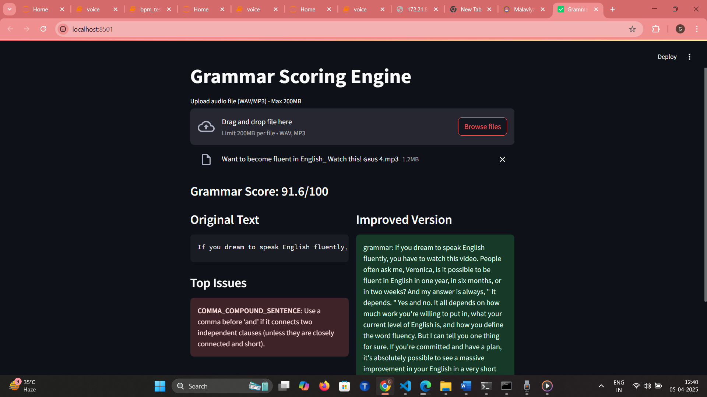

# 🎧 Grammar Scoring Engine

A comprehensive system for analyzing spoken English grammar through audio input, providing scores, error explanations, and corrected text suggestions.



---

## 🚀 Features

### 🎙️ Audio Processing
- Supports `.wav` and `.mp3` files (up to 200MB)
- Converts speech to text using [OpenAI Whisper](https://github.com/openai/whisper)
- Auto-resampling to 16kHz for consistent quality

### 📊 Grammar Analysis
- Scoring system (0-100)
  - ✅ 70% Rule-based via LanguageTool
  - ✅ 30% Neural scoring via BERT
- Displays:
  - Top 3 grammar error explanations
  - Rule IDs for each error

### 🛠️ Auto-Correction
- Uses FLAN-T5 for context-aware grammatical corrections
- Provides improved sentence suggestions

### 💻 Technical Highlights
- No GPU required – works on CPU
- Streamlit-based web UI
- No local Java needed (remote LanguageTool API used)
- Cross-platform (Windows/Linux/macOS)

---

## 📋 Prerequisites

- Python **3.10+**
- (Optional) Java Runtime for local LanguageTool usage
- At least **2GB** disk space (for models)
- Minimum **4GB RAM** for smooth operation

---

## ⚙️ Installation

### 1. Clone the repository
```bash
git clone https://github.com/yourusername/grammar-scoring-engine.git
cd grammar-scoring-engine
# -Grammar-Scoring-Engine
